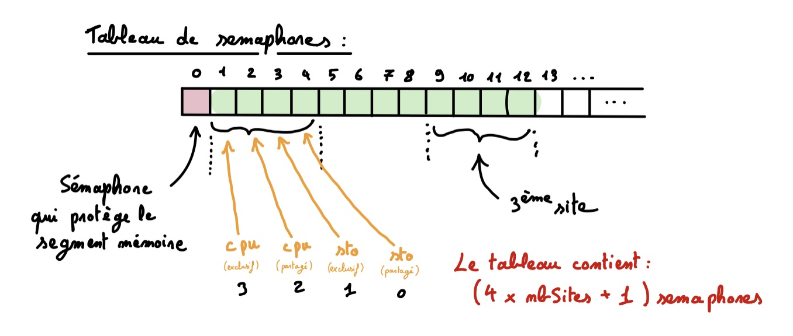

# HMIN105M - Projet

## Système de réservation distribué

L'objectif de ce document est de définir l'architecture de notre application. Nous allons voir comment nous avont définie dans notre projet : 

- Notre politique de réservation

- La structure état système
- Les objets IPC ainsi que le principe de leurs utilisations
- Les processus et threads ainsi que leurs roles
- Le protocole d’échange à distance utilisé

### Notre politique de réservation

Pour répondre aux besoins de ce projet, nous avons définie une politique de reservation. 

Le nombre de site maximum dans l'état du système est limité à 100.
Nous avons décider de définir qu'un cpu peut être partagé par 4 clients. De même, un espace de stockage de 1Go peut être partagé par 4 clients.
Ainsi sur un site contenant 50 cpu exclusifs, le client aura la possibilité de louer au maximum 200 cpu en mode partagé (car 4x50 = 200). 

Pour faire une réservation, un client doit réserver au minimum 1 cpu sur le site qu'il demande et à la possibilité de réserver ou non du stockage.

Ainsi, il ne peut y avoir plus de clients que de cpu en mode exclusif sur un site donné.

### La structure de l'état du système

Dans la structure de l'état du système, voici les informations dont nous auront besoin de sauvegarder :

- le nombre de sites dans le système
- les identifiants utilisateurs associé à leur nom
- les identifiants utilisateurs associé au numéro de leur sémaphore de notification
- les informations sur chaque sites :
  - l'identifiant du site
  - le nom du site
  - le nombre de cpu initiale sur le site
  - le nombre de stockage initial sur le site
  - les quantités de cpu et de stockages libre (en mode exclusif et en mode partagé) sur le site 
  - Les réservations en mode exclusif avec : 
    - l'identifiant du client
    - le nombre de cpu reservé
    - le nombre de stockage reservé
  - Les réservations en mode partagé avec : 
    - l'identifiant du client
    - le nombre de cpu reservé
    - le nombre de stockage reservé

 

### Les objets IPC et leurs principes d'utilisations

Voici les objets IPC que nous utilisont dans ce projet :

- **Un segment mémoire** : ce segment mémoire permet de partagé l'état du système entre tous les processus fils du server.

- **Deux tableaux de sémaphores** :

  - Le **tableau de sémaphores 1 (Les ressources)** est utilisé pour stocker le sémaphore qui permet de protéger le segment mémoire et de stocker tous les sémaphores qui représente les différentes ressources de chaque site.
    Le le sémaphore 0 est celui qui va permettre de protégé le segment mémoire. Ce sémaphore est initialisé à 1.
    Les sémaphores suivant sont initialisé avec des valeurs qui permette de représentant les ressources (cpu et stockage) dans les deux modes de réservation *[Voir le shéma ci-dessous]*.

    

  - Le **tableau de sémaphores 2 (Les notification)** est utilisé pour stocker un sémaphore propre à chaque client qui permet de représenter la présence ou l'absence d'une notification.
    Le sémaphore numéro 0 est la notification pour le processus serveur parent, afin d'avoir un affichage sur ce dernier.
    Quand la valeur d'un sémaphore du tableau est égale à un, cela signifie que le processus associé à ce sémaphore à reçu une notification (donc cela signifie que l'état du système à été modifié).

### Les processus et threads

Le système de réservation distribué comprend deux programmes : Un programme qui s’execute sur le server et un programme qui s’execute sur le client. Plusieurs clients différents peuvent se connecter sur le server. Dans la consigne il est noté que le processus server attent la connection des clients puis delègue la suite du travail à ses processus fils. Cela signifie que l'on doit faire une fork dans le programme du server afin que chaque client soit connecter avec un processus fils du server.

Du coté client comme du coté server, notre architecture utilise deux threads : 

- Un thread pour l'affichage du système : il attend de recevoir l'état du server mis à jour.
- Un thread pour vérifier que l'on est toujours conneté au server : si jamais le server à un problème, ce thread receptionne le message.

Et on a le programme principale du client qui se charge de récupérer les saisie de l'utilisateur.

Du coté du server, on a :

-  le thread qui envoie au client le nouvel état du server après une modification par un client.

- et le programme principale qui récupère les requètes des clients.

  

### Le protocole d’échange à distance utilisé

Le protocole d'échange utilisé dans notre architecture est le protocole TCP, comme demandé dans la consigne du projet.

- - 